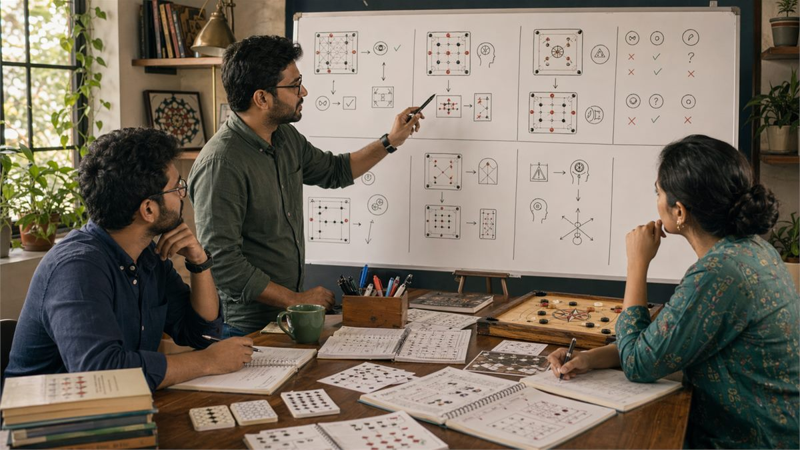

# Common Mistakes in Game Analysis

## 🪶 Introduction

Identifying and correcting common mistakes is one of the fastest paths to improvement in any game. Many players spend years making the same errors without recognizing them, which limits their progress and creates frustration. By understanding what typically goes wrong in game analysis, you can develop awareness of these pitfalls in your own play and address them systematically.

This guide examines the most frequent mistakes that players make when analyzing games, studying opponents, and making decisions. These errors are not unique to any specific game but appear across the Indian gaming landscape in card games, board games, and skill-based competitions. Understanding why these mistakes happen helps you avoid them more effectively than simply memorizing what not to do.

The goal is not perfection but continuous improvement. Even experienced players occasionally fall into these traps. The difference is that skilled players recognize their mistakes quickly and adjust rather than compounding errors through stubbornness or denial.

---

## 🖼️ Common Mistakes Overview

---

## 🎯 What Are Common Mistakes?

Common mistakes in game analysis are systematic errors that appear frequently across players of various skill levels. They fall into several categories: cognitive biases that distort judgment, strategic errors that sacrifice value, procedural mistakes that undermine learning, and interpersonal errors that create disadvantages against observant opponents.

These mistakes are called common because they reflect natural human psychology rather than individual weakness. Everyone makes them. The players who improve fastest are those who develop self-awareness about their specific tendencies and build habits that counteract these natural errors.

Understanding common mistakes also helps you anticipate them in opponents. When you recognize that certain errors are predictable, you can exploit opponent mistakes while avoiding making them yourself. This dual awareness is a significant strategic advantage.

# 🧠 1. Confirmation Bias in Observation

Confirmation bias leads players to notice information that supports their existing beliefs while overlooking contradictory evidence. If you believe a particular opponent is conservative, you tend to interpret ambiguous actions as confirmation of that belief while discounting signs of aggression that would challenge your assessment.

The problem with confirmation bias is that it creates false confidence in reads that may be outdated or incorrect. An opponent may have changed their strategy, but confirmation bias keeps you locked into an old reading that no longer applies. This leads to systematically misreading situations and making poor decisions based on flawed analysis.

Counteracting confirmation bias requires active seeking of contradictory evidence. When you form a belief about an opponent or situation, explicitly ask yourself what evidence would contradict that belief and check whether that evidence exists. This simple practice reveals blind spots that would otherwise persist undetected.

Training yourself to update beliefs based on new information rather than defending old beliefs helps maintain accuracy. After each significant game event, reassess your reads and be willing to abandon beliefs that no longer fit the evidence.

# 🧠 2. Outcome-Based Thinking Instead of Decision-Based Thinking

The tendency to judge decisions by outcomes rather than by the quality of the decision process leads to systematic learning failures. A good decision that happens to produce a bad outcome is still a good decision, while a bad decision that happens to work is still a bad decision. Judging by outcomes conflates these and rewards luck rather than skill.

This mistake manifests when players abandon sound strategies because those strategies produced a losing result in a particular session. The statistical reality is that even optimal decisions sometimes lose, and recognizing this requires thinking in terms of expected value and long-term results rather than individual outcomes.

Outcome-based thinking also distorts opponent analysis. You may conclude that an opponent made a mistake because they lost, when in fact their decision was sound but unlucky. This misanalysis leads you to expect them to repeat the mistake when they are actually making correct decisions that just did not work out this time.

Keeping decision logs that record your reasoning at the time of each choice allows for later review that separates decision quality from outcome quality. When you review, evaluate whether your process was sound given the information you had, not whether it produced a winning result.

# 🧠 3. Anchoring on Previous Game States

Anchoring occurs when you fixate on an earlier assessment and fail to adjust properly as new information arrives. In game contexts, this often appears as clinging to an initial read of an opponent despite clear evidence that the read is no longer accurate. The earlier assessment serves as an anchor that distorts how you interpret new data.

For example, if you initially read an opponent as passive and then see them make an aggressive play, anchoring makes you interpret that aggressive play as a rare exception rather than evidence of a changed strategy. This misinterpretation leads to decisions based on an outdated model that no longer reflects reality.

Breaking anchoring requires deliberate effort to update assessments when contradictory evidence appears. When you notice new information that does not fit your current model, take it as a signal to rebuild the model from scratch rather than trying to force-fit it into existing categories.

Practicing by explicitly stating your current read and then listing evidence for and against that read helps maintain accuracy. If the evidence against your read outweighs evidence for it, updating becomes necessary regardless of how confident you were in the original assessment.

# 🧠 4. Overgeneralizing from Small Samples

Drawing strong conclusions from limited experience leads to unreliable beliefs that guide poor decisions. If you see an opponent make a particular play once, that tells you very little about their tendencies. Yet many players form firm beliefs from single observations and then make decisions based on those underdetermined conclusions.

The problem with overgeneralization is that human behavior is variable. Any individual action might be representative of a general tendency or might be a one-time exception caused by unique circumstances. Without sufficient repetition, there is no reliable way to tell which is the case.

Statistical thinking helps here. Small samples can only support weak conclusions. The more extreme a conclusion you want to draw, the more evidence you need to support it. Forming tentative hypotheses from small samples and treating them as provisional rather than established facts prevents overgeneralization errors.

When facing a new opponent, start with no assumptions and build beliefs gradually as evidence accumulates. Initial games should inform your model rather than lock you into conclusions. The longer you play against consistent opponents, the more reliable your assessments become.

# 🧠 5. Neglecting Base Rates and Prior Probabilities

Ignoring how often something typically happens leads to over-updating on unusual events. If a certain type of hand rarely leads to victory, but you happened to win with it this time, neglecting base rates leads you to overestimate the hand's strength in future situations. The prior probability should constrain how much new evidence sways your beliefs.

Base rate neglect appears when players give too much weight to recent experience relative to long-term frequencies. A player who normally plays conservatively but made one aggressive play is not necessarily changing strategies. That one play might represent noise rather than signal.

The practical fix is to maintain awareness of background rates and let them influence your conclusions. When evaluating a situation, ask yourself how often similar situations have turned out well or poorly in your experience, and let that prior inform your current assessment.

This does not mean ignoring new evidence entirely. Rather, it means integrating new information with prior knowledge in appropriate proportions. If new evidence is strong and consistent, it should update your beliefs significantly. If new evidence is weak or ambiguous, the prior should remain dominant.

# 🧠 6. Neglecting Opponent Perspective and Intentions

Focusing exclusively on your own position without considering why opponents are playing as they are leads to misunderstandings of game situations. Every action an opponent takes is motivated by their perception of the situation and their goals. Interpreting their actions requires understanding their perspective, not just analyzing board state.

This mistake appears as assuming opponents play randomly or based on your strategy rather than their own. Observing that an opponent made a puzzling play often means you are not seeing the situation from their viewpoint. Understanding their perspective often makes even strange moves comprehensible.

Developing theory of mind about opponents means asking what they see, what they want, and what they think you are doing when they make each decision. This perspective-taking reveals their likely intentions and helps predict future actions more accurately than analysis that ignores mental states.

The sophistication of opponent modeling should match the situation. Against weak opponents, simple models suffice. Against strong opponents who are also modeling you, the game becomes more complex and requires deeper consideration of nested beliefs about what each player knows and intends.

# 🧠 7. Premature Decision Closure

Reaching conclusions before considering all available information leads to avoidable mistakes. Many players decide what to do within the first few seconds of encountering a situation and then spend remaining time rationalizing that decision rather than genuinely analyzing alternatives. The initial impression is treated as the answer rather than the starting point of analysis.

Premature closure is dangerous because first impressions are often misleading, especially in complex situations where the most obvious move is rarely the optimal one. Spending time with a problem before committing allows deeper exploration of options and consequences.

Counteracting premature closure requires forcing yourself to generate multiple alternatives before selecting one. Even if you are confident the first option is best, the exercise of exploring alternatives often reveals considerations you initially missed. Making this exploration a habit prevents premature commitment.

Setting a minimum time for significant decisions helps. If you normally decide in seconds, force yourself to wait at least thirty seconds and explicitly consider alternatives. Even if you ultimately pick the same option, the process builds better habits and occasionally reveals better choices.

# 🧠 8. Confusing Correlation with Causation

When two events occur together, it is easy to assume one caused the other, but many apparent relationships are coincidental or mediated by third factors. In game analysis, this leads to false beliefs about what strategies or behaviors actually produce success.

For example, if you notice that you tend to win when wearing a certain color, you might conclude that the color causes winning. The actual cause might be that you play differently when comfortable or that winning puts you in a better mood that affects subsequent play. The correlation is real but the causation is different from what appears.

The solution is demanding strong evidence for causal claims. Correlation suggests relationships worth investigating but does not prove causation. Before concluding that X causes Y, consider alternative explanations, look for mechanisms, and test whether the relationship holds in different contexts.

This extends to analyzing opponent behavior. Just because an opponent played aggressively before succeeding does not mean aggression caused the success. Understanding the true causal structure of games produces better predictions and better decisions than relying on superficial patterns.

---

## ⚠️ Common Mistakes

1. **Using results to judge decisions instead of evaluating the decision process**: A bad outcome does not always mean a bad decision, and a good outcome does not always mean a good decision. Judge the process, not just the results.

2. **Refusing to update beliefs when new evidence contradicts them**: Once you have formed a read, it is psychologically difficult to abandon it even when evidence clearly contradicts it. Training yourself to update more readily improves accuracy.

3. **Taking single observations as strong evidence**: One data point tells you very little. Strong beliefs require strong evidence from multiple observations.

4. **Focusing only on your own game state and ignoring what opponents are doing and why**: Complete analysis requires understanding the entire game situation, not just your own position.

5. **Making quick decisions and then rationalizing rather than genuinely analyzing**: If you decide in seconds and spend minutes justifying, you are likely making suboptimal choices through premature closure.

6. **Seeing patterns that are actually random noise**: Not every fluctuation represents a real trend. Distinguishing signal from noise requires statistical awareness and appropriate skepticism.

---

## 🧾 Summary

Common mistakes in game analysis stem from natural cognitive biases and strategic errors that affect all players. Recognizing these patterns in your own play, developing systematic checks against them, and maintaining intellectual humility about your reads and decisions dramatically improves analysis quality. Address one category of mistakes at a time rather than trying to fix everything at once.

---

## 🔥 SEO Keywords

game analysis mistakes
common gaming errors
cognitive bias in games
decision making errors
player mistake analysis
game strategy errors
analytical mistakes gaming
improving game analysis
avoid gaming mistakes
strategic error patterns

---

## Related Pages

- [Fundamentals of Game Insights](./fundamentals.md)
- [Decision Making Fundamentals](./decision-making.md)
- [Pattern Recognition Skills](./pattern-recognition.md)
- [Strategic Thinking Development](./strategic-thinking.md)
- [Advanced Concepts](./advanced-concepts.md)

## External Reference

For a broader reference, see [related gameplay notes](https://market-lab-cmd.github.io/india-skill-gaming-hub/)