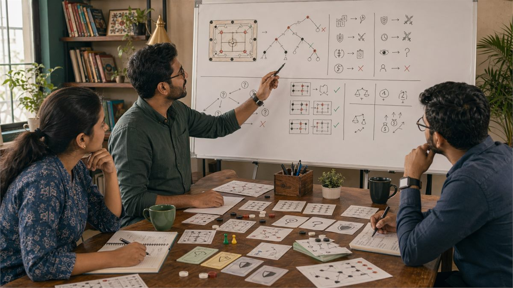

# Decision Making in Indian Games

## 🪶 Introduction

Decision making sits at the heart of every game, and the quality of your decisions determines your results more than any other factor. In Indian games ranging from rummy to carrom to regional favorites, the ability to process information quickly, evaluate options accurately, and execute choices under pressure separates consistent performers from casual players. Understanding how to make better decisions is the single most impactful skill you can develop.

This guide explores the decision-making process in depth, examining how information gathering, option evaluation, and choice execution work together to produce outcomes. You will learn practical techniques for improving each stage of the process and for recognizing when your decision-making is being degraded by internal or external factors.

The goal is not to find a magic formula for always making correct decisions, since no such formula exists. Instead, you will develop a framework for making decisions that are systematically better than your current approach, leading to better results over time even when individual decisions do not work out.

---

## 🖼️ Decision Making Overview

---

## 🎯 What Is Decision Making?

Decision making in games is the process of selecting among available options based on your assessment of the game state, likely outcomes, and your goals. This process involves gathering information, generating alternatives, evaluating consequences, and executing choices while managing time pressure and emotional states that can degrade quality.

Good decision making produces choices that maximize expected value given the information available, even when those choices do not work out in particular instances. Bad decision making produces choices that sacrifice value through incomplete information processing, emotional interference, or systematic biases that distort assessment.

The decision-making process operates under uncertainty, meaning you rarely have complete information about game states or opponent intentions. Working effectively under this uncertainty requires comfort with probabilistic thinking and acceptance that the best decisions sometimes produce bad outcomes through no fault of your own.

Improving decision making means improving both the process you use and the quality of information you feed into that process. Both components matter, and neglecting either leads to suboptimal results.

# 🧠 1. Information Gathering and Situation Assessment

Every decision starts with understanding the current game state, and the quality of that understanding determines the quality of resulting decisions. Gathering information means observing what is happening, remembering relevant facts from earlier in the game, and integrating that information into a coherent picture of where you stand.

Situation assessment requires accuracy and completeness. Missing relevant information leads to decisions based on incomplete pictures, which systematically underperform decisions based on complete information. Developing sharp observation habits ensures you enter decision points with accurate data rather than flawed assumptions.

Different games provide different types of information. In games with public information like chess or carrom, observation of all pieces and their positions matters. In games with private information like card games, observation of what has been revealed and opponent behavior patterns fills in the picture over time. Adapting your information gathering to the game's structure maximizes what you learn.

The accuracy of situation assessment also depends on avoiding cognitive errors that distort perception. Confirmation bias, anchoring, and recency effects can all corrupt your understanding of the current state. Building awareness of these potential distortions and checking against them maintains assessment accuracy.

# 🧠 2. Generating and Evaluating Options

Once you understand the game state, decision making requires generating possible actions and evaluating their likely outcomes. Many players make the mistake of considering only the obvious option and not genuinely exploring alternatives before committing to a choice.

Generating options means deliberately expanding the set of considered actions beyond what immediately comes to mind. The first option you think of is often not the best, since initial thoughts tend toward familiar patterns rather than optimal solutions. Forcing yourself to consider multiple alternatives uncovers choices that might have been overlooked.

Evaluation requires estimating the expected value of each option, considering both the probability of different outcomes and the value of those outcomes. This estimation does not need to be precise to be useful. Relative comparisons between options often reveal which choices dominate others even without exact calculations.

Trade-offs between options are common and require explicit consideration. One option might offer higher upside but greater risk. Another might be safer but capture less value. Understanding what you are trading off in each decision clarifies the implications of each choice and helps you align decisions with your overall strategy.

# 🧠 3. Heuristics and When to Use Them

Heuristics are mental shortcuts that allow fast decisions without exhaustive analysis. They are valuable when time is limited or when the stakes do not justify extensive analysis. However, relying on heuristics inappropriately leads to systematically biased decisions that can be exploited by observant opponents.

Effective heuristic use means recognizing when a situation is similar enough to patterns you have encountered before that detailed analysis is unnecessary. When you have seen hundreds of similar situations and developed reliable intuitions about them, acting on those intuitions is often more efficient than re-analyzing from scratch.

The risk of heuristics is that they can fail when applied to situations that look similar to familiar situations but differ in crucial respects. A heuristic that works in most cases might lead to a serious error in an atypical situation. Knowing when to override your intuitions and analyze more carefully is itself a skill developed through experience.

Developing good heuristics requires deliberate practice and feedback. When a heuristic works, notice why it worked and when it might fail. When it fails, analyze what made the situation different and update your understanding accordingly. This iterative process refines heuristics over time.

# 🧠 4. Managing Time Pressure

Time pressure affects decision quality by forcing faster processing and increasing emotional arousal. Under pressure, people tend to rely more on heuristics and less on careful analysis, which can lead to both faster decisions and more errors. Managing time pressure effectively means recognizing when pressure is degrading your decisions and taking steps to compensate.

Recognizing the signs of time pressure degradation helps you know when to slow down despite external urgency. Common signs include feeling rushed, fixating on one option, racing ahead to conclusions, and feeling certain despite lacking clear reasoning. When you notice these signs, forcing deliberate slow-down improves decision quality even when clock time does not increase.

Practical techniques for managing time pressure include pre-planning for likely situations so you have responses ready when they arise, setting decision time budgets for different types of choices, and developing routines that maintain composure under pressure. These techniques work best when practiced during training rather than invented during actual games.

Time pressure can be used strategically against opponents who are sensitive to it. Creating pressure through pace of play or explicit time references can induce errors in opponents who struggle under time pressure. However, this tactic should be used judiciously and never at the cost of your own decision quality.

# 🧠 5. Emotional State and Decision Quality

Emotional state significantly influences decision-making capabilities. Excitement, frustration, anxiety, and anger all affect how information is processed and what options are considered. Learning to recognize when emotional states are degrading your decisions allows you to compensate or delay decisions until emotional states normalize.

The relationship between emotion and decision-making is bidirectional. Emotions affect decisions, and decisions affect emotions. Understanding this cycle helps you manage both. When you feel emotionally activated, decisions tend to be more impulsive and less thoroughly analyzed. Recognizing this pattern leads to conscious efforts to slow down and apply more deliberate analysis.

Managing emotional states during games requires both on-the-spot techniques and longer-term emotional regulation skills. In-the-moment techniques include taking deep breaths, explicitly acknowledging your emotional state, and making a conscious decision to slow down. Longer-term skills include regular practice of awareness and regulation, which carry over into game situations.

Maintaining appropriate emotional investment in games helps performance. Too little emotional engagement produces careless play, while too much produces anxious or aggressive play. Finding your optimal level of emotional investment allows full engagement without the degradation that extreme emotions cause.

# 🧠 6. Decision Documentation and Review

Keeping records of your decisions and the reasoning behind them enables later review that reveals patterns and errors that would otherwise go unnoticed. Without documentation, reviewing past decisions relies on memory, which is unreliable and selective. With documentation, you can analyze your actual decision process and identify specific improvement opportunities.

Documentation should include the game state as you understood it, the options you considered, your choice, and your reasoning at the time. Outcome information should be recorded but treated separately from decision quality assessment. A decision log entry might say "chose option B because X seemed more likely, but option A would have been better given Y" without reference to whether you won or lost.

Review of decision logs should happen soon after games while details are fresh. Look for moments where you felt uncertain and analyze whether your uncertainty was warranted by later events. Identify systematic patterns in your decision errors. Pay attention to what types of situations produce the most后悔 and why.

Sharing decision logs with others or discussing them in communities provides additional perspectives that reveal blind spots in your own analysis. Others often see errors or alternatives that you miss, accelerating your improvement. This external input is particularly valuable for identifying biases you are unaware of.

# 🧠 7. Probabilistic Thinking in Decisions

Games involve uncertainty, and thinking probabilistically allows you to make optimal decisions despite incomplete information. This means evaluating options based on expected value rather than best-case or worst-case scenarios, and accepting that even good decisions sometimes produce bad outcomes.

Expected value calculation combines the probability of each possible outcome with the value of that outcome, producing a weighted average that represents the likely value of a choice. Comparing expected values across options reveals which choice is best even when individual outcomes are uncertain.

Probability estimates in games come from two sources: base rates from long-term frequencies and current information that updates those rates. Base rates tell you how often something happens in general. Current information tells you whether this particular situation is more or less likely than average. Combining both sources produces better estimates than either alone.

Developing probabilistic thinking requires practice thinking in percentages and being comfortable with uncertainty. When facing a decision, estimate probabilities for each outcome, calculate expected values, and compare those values across options. This practice builds intuitions that make probabilistic thinking faster and more natural over time.

# 🧠 8. Decision Quality Assessment and Calibration

Assessing your own decision quality accurately requires calibration, which means comparing your confidence in your decisions with how often those decisions turn out to be correct. Overconfident players make worse decisions because they stop checking themselves. Well-calibrated players maintain appropriate uncertainty and continue learning from feedback.

Calibration practice involves making decisions and recording your confidence in them, then tracking whether they were correct. Over time, you can see whether your confidence matches your accuracy. If you are overconfident, you will be correct less often than your confidence suggests. If well-calibrated, your confidence will match your accuracy rate.

Improving calibration requires honest self-assessment and willingness to acknowledge errors. It also requires gathering sufficient sample sizes to distinguish actual skill from random variation. With small samples, lucky streaks can look like competence, and unlucky streaks can look like incompetence. Larger samples reveal true patterns.

Calibration also improves decision quality by making you aware of the limits of your knowledge. When you recognize that you are often wrong, you become more careful in your assessments and more willing to consider alternatives. This humility produces better analysis than overconfidence ever could.

---

## ⚠️ Common Mistakes

1. **Analyzing only the obvious option instead of genuinely exploring alternatives**: If you only consider one option, you cannot know whether it is better than alternatives you have not considered.

2. **Confusing confidence with correctness**: Feeling certain does not make a decision correct. Calibrated uncertainty alongside confident action produces better results than unearned certainty.

3. **Ignoring base rates and prior probabilities**: New information should update your beliefs but not completely overwhelm what you knew before. Prior knowledge constrains how much new evidence should change your views.

4. **Making decisions under emotional distress without compensation**: Strong emotions degrade analytical capabilities. When emotional, either wait until you calm down or consciously force more deliberate analysis.

5. **Failing to document decisions for later review**: Memory is unreliable. Writing down decisions and reasoning allows accurate review that reveals patterns and errors.

6. **Using outcome to evaluate decision quality instead of decision process**: Good decisions can produce bad outcomes and bad decisions can produce good outcomes. Judge the process, not the result.

---

## 🧾 Summary

Effective decision making in Indian games requires systematic information gathering, genuine exploration of alternatives, probabilistic thinking, and emotional management. Develop habits of documentation and review that reveal your actual decision patterns. Calibration practice helps you maintain appropriate confidence and continue improving. Focus on process quality rather than immediate outcomes.

---

## 🔥 SEO Keywords

game decision making
strategic decisions India
decision quality improvement
probabilistic thinking games
emotional control gaming
time pressure decisions
game analysis process
decision heuristics
calibration gaming
decision documentation

---

## Related Pages

- [Fundamentals of Game Insights](./fundamentals.md)
- [Common Mistakes in Game Analysis](./common-mistakes.md)
- [Game Awareness Development](./game-awareness.md)
- [Strategic Thinking Development](./strategic-thinking.md)
- [Advanced Concepts](./advanced-concepts.md)

## External Reference

For a broader reference, see [related gameplay notes](https://market-lab-cmd.github.io/india-skill-gaming-hub/)