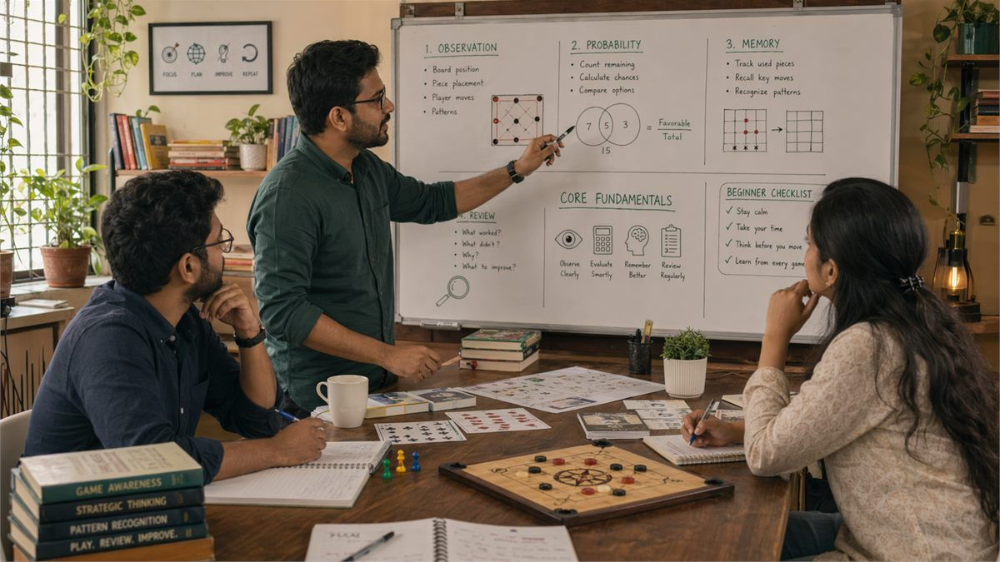

# Fundamentals of Game Insights for India

## 🪶 Introduction

Understanding game fundamentals is the foundation of developing genuine strategic awareness in games popular across India. Whether you are analyzing rummy, chess, carrom, or other traditional games, the core principles of observation, calculation, and adaptation remain consistent. Without a solid grasp of these fundamentals, players and analysts alike find themselves making decisions based on intuition rather than logic, which leads to inconsistent results and missed opportunities for improvement.

This guide will walk you through the essential concepts that underpin successful gameplay analysis in the Indian context. You will learn how to break down complex game situations into manageable components, recognize the difference between outcomes based on skill versus chance, and develop a systematic approach to studying games that produces measurable improvement over time. The goal is not to memorize formulas but to build a mental framework that helps you parse information quickly and make better decisions under pressure.

By the end of this guide, you will have a clear understanding of what separates casual players from those who consistently perform at a higher level, and you will know exactly where to focus your learning energy to close that gap efficiently.

---

## 🖼️ Fundamentals Overview

---

## 🎯 What Is Game Fundamentals?

Game fundamentals refer to the basic building blocks of strategic thought that apply across different games and contexts. In the Indian gaming landscape, these include understanding game mechanics at a deep level, recognizing how probability influences outcomes, developing pattern recognition for common situations, and building the habit of reviewing your decisions systematically after each session.

Fundamentals are not about learning specific tricks or shortcuts. They are about building a durable foundation of knowledge and skills that will serve you well regardless of which game you are playing or how the competitive landscape evolves. A player who has mastered fundamentals can adapt to new game variations or entirely new games much faster than someone who has only memorized specific plays without understanding the underlying reasoning.

The distinction between fundamentals and surface knowledge is important. Surface knowledge tells you that a certain play works in a certain situation. Fundamentals tell you why that play works, when it might fail, and how to adjust it when circumstances change. This deeper understanding is what allows you to innovate and adapt rather than simply repeating what has worked before.

# 🧠 1. Observation Skills as the Foundation

The first and most important fundamental skill is the ability to observe accurately and completely. Many players watch games unfold but fail to register critical information that would change their decisions if they noticed it. Developing sharp observation means training yourself to notice not just the obvious moves but also the subtle patterns in how opponents play, the sequence of events that led to the current situation, and the small tells that reveal information about other players' intentions.

Observation begins before the game starts. Paying attention to how opponents interact before play begins, how they handle their cards or pieces, and how they respond to different types of pressure gives you a baseline against which to measure their behavior during the game. Players who seem calm early but become erratic under pressure are fundamentally different from those who maintain consistency throughout. Knowing which type you are facing changes how you approach key decisions.

During play, observation means tracking not just your own situation but all relevant game state information. In card games, this includes what has been played, what remains in the deck, and what other players have done. In board games, it means understanding the position of all pieces and the likely intentions behind each move your opponents make. The goal is to build a complete mental picture of the game state that you can use to evaluate your options.

The practical way to improve observation is to deliberately slow down your play and verbalize what you notice. After each game, write down three things you observed that you initially missed but later recognized as important. Over time, this practice trains your brain to notice these patterns in real time rather than in retrospect.

# 🧠 2. Understanding Probability and Odds

Every game involves elements of chance, and understanding probability is essential for making optimal decisions. This does not mean you need advanced mathematics. It means you need a practical sense of how likely different outcomes are and how to compare the expected value of different choices. In Indian games like rummy, probability guides which cards to discard and which combinations to pursue. In games like carrom or table tennis, probability affects how you approach situations where skill and luck intersect.

The key concept is expected value, which combines the probability of each outcome with the value of that outcome. A play might have a high reward if things go well but a low probability of success, making its expected value lower than a more modest play with higher chances of succeeding. Understanding this helps you avoid both overly aggressive and overly conservative decisions.

Probability awareness also affects how you interpret results. A single loss does not mean you made a bad decision, and a single win does not mean you played perfectly. Over a larger sample of decisions, the influence of skill becomes clearer while the impact of luck diminishes. This is why serious players track their decisions and outcomes over time rather than drawing conclusions from individual sessions.

Developing probability sense requires practice thinking in percentages and fractions. When you encounter a decision, estimate the chance of each outcome as a percentage, then use those estimates to guide your choice. Over time, your estimates will become more accurate, and your decision quality will improve accordingly.

# 🧠 3. Memory and Information Management

Games generate大量的 information, and your ability to retain and use that information directly impacts your strategic capability. Memory in games is not about memorization in the traditional sense but about maintaining relevant facts in accessible short-term memory while building long-term patterns from repeated exposure to similar situations.

Effective memory in gameplay means tracking what has happened, what conclusions you can draw from those events, and how that knowledge informs current decisions. In games with shared information like chess or checkers, memory of previous games against the same opponent can inform your strategy. In games with private information like card games, memory of what has been played helps you estimate what remains.

The technique of mental rehearsal helps both memory and decision quality. Before making important decisions, take a moment to mentally review what you know about the current situation, what options you are considering, and what outcomes you expect from each. This brief review session helps consolidate relevant information in memory while forcing you to articulate your reasoning explicitly.

Information management also means knowing when you have enough information to decide versus when you need more observation before committing. Rushing to conclusions based on incomplete information leads to preventable mistakes, while waiting too long for certainty can cost you opportunities. The skill is recognizing when your current knowledge is sufficient for the decision at hand.

# 🧠 4. Mental Models and Game State Representation

Your brain processes game information through mental models, which are simplified representations of the actual game state that highlight the most relevant details for decision-making. Developing accurate and useful mental models is a fundamental skill that accelerates learning across all types of games.

A good mental model captures the essential elements of the game while filtering out irrelevant details. For example, in a card game, a useful mental model might track the relative strength of your hand, the probability of improving, and the likely hands of opponents based on their actions. It would not waste mental energy on details like the specific design of the cards or the color of the table unless those details are actually relevant to decisions.

Building mental models requires active effort to organize information you observe into coherent structures. After games, spend time thinking about how you would explain the game state to someone else. This exercise forces you to identify what matters and what can be safely ignored, which sharpens your mental model over time.

Different situations call for different mental models. A model useful for evaluating whether to continue in a hand differs from a model useful for analyzing why you lost a game after it ended. Developing a repertoire of models for different contexts makes you more versatile and adaptive in your gameplay.

# 🧠 5. Emotional Control and Decision Temperature

Emotional state significantly influences decision quality, and managing emotions is a fundamental skill that separates consistent players from inconsistent ones. When you are calm, you access your full analytical capabilities. When you are frustrated, excited, or anxious, your brain relies more on heuristics and less on careful analysis, leading to predictable errors.

Understanding your decision temperature means recognizing when your emotional state is affecting your judgment. The signs differ between people but often include rushing decisions, fixating on specific options while ignoring alternatives, and feeling certain despite lacking clear justification for that certainty. When you notice these signs, it is time to slow down and explicitly force yourself to consider more options.

Practical techniques for managing decision temperature include taking breaks when frustration rises, setting predetermined criteria for important decisions so emotion does not override logic, and developing routines that center you before critical moments. These techniques work best when practiced regularly, not just when you notice yourself becoming emotional.

The relationship between confidence and competence is tricky. Some overconfidence leads to careless mistakes, but appropriate confidence allows you to act decisively when needed. The goal is not to eliminate confidence but to ensure it is calibrated to actual competence and current game state awareness.

# 🧠 6. Learning from Review and Analysis

Improvement requires deliberate reflection on your decisions and outcomes. The review process transforms individual experiences into transferable knowledge that shapes future decisions. Without systematic review, players repeat mistakes indefinitely and fail to consolidate successes into reliable patterns.

Effective review happens immediately after games when details are fresh. Ask yourself what decisions you faced, what information you had, what you chose, and what happened as a result. Identify the moments where you felt uncertain and analyze whether your uncertainty was justified by what happened later. This process reveals both what you got right and what you got wrong.

Pattern identification in review reveals systematic tendencies that may be helpful or harmful. Perhaps you consistently overvalue certain types of hands or consistently underestimate opponents in particular situations. Recognizing these patterns allows you to address them directly rather than continuing to make the same errors.

Review should also include studying games from outside your own experience. Watching stronger players, analyzing documented games, and reading about strategic principles exposes you to ideas and approaches you would not discover on your own. This external learning complements your direct experience and accelerates improvement.

# 🧠 7. Time Management and Pace Control

How you use your time during games affects both your decisions and your opponents' perceptions of you. Time management is a fundamental skill that many players neglect, focusing only on the immediate decision rather than the rhythm of the entire game session.

Taking appropriate time for decisions means balancing thorough analysis with practical flow. In games with time limits, this is obvious. In games without explicit clocks, taking too long signals weakness to observant opponents while rushing signals carelessness. Finding the right pace for each situation is a nuanced skill developed through experience.

Deliberate time usage includes taking moments of rest during games you are winning to maintain composure, using time strategically to pressure opponents who struggle under time pressure, and slowing down in complex situations where the right decision is not immediately obvious. These uses of time require awareness of both your own state and your opponents' tendencies.

Practicing with time pressure in training helps you develop comfort with faster decision-making without sacrificing accuracy. The goal is to build enough pattern recognition and calculation speed that you can reach good decisions quickly without the anxiety that comes from feeling rushed.

# 🧠 8. Building Adaptive Flexibility

The ability to adapt your strategy when circumstances change is a fundamental skill that becomes increasingly important as you face stronger opponents. A rigid player who plays the same way regardless of situation is predictable and exploitable. An adaptive player changes approaches based on game state, opponent behavior, and evolving conditions.

Adaptation requires accurate reading of the current situation and willingness to abandon plans that are no longer optimal. This does not mean changing strategies constantly, which itself becomes predictable. It means recognizing when external factors have shifted enough that a different approach is warranted.

Flexibility develops from experience across many different game states and opponents. The more varied your experience, the better your ability to recognize when adaptation is needed and what adaptations are likely to work. Reading broadly about game strategy also helps by exposing you to approaches you might not discover through personal experience alone.

The balance between consistency and adaptation is itself a skill. Being completely unpredictable is as problematic as being completely predictable. The goal is strategic flexibility that responds to genuine signals about what the current situation requires.

---

## ⚠️ Common Mistakes

1. **Focusing on outcomes rather than decisions**: Judging your play based on whether you won or lost rather than whether your decision-making process was sound leads to poor learning and reinforcement of unlucky strategies.

2. **Ignoring games where you won easily**: When you win without challenge, you learn less than when you struggle and lose. Treating easy wins as confirmation of strong play prevents growth.

3. **Not reviewing until you feel ready**: Waiting to review until motivation strikes means many valuable learning opportunities are missed. Making review a systematic habit regardless of how you feel about recent results accelerates improvement.

4. **Confusing confidence with correctness**: Feeling certain about a decision does not make it correct. Maintaining awareness of uncertainty even when confident leads to better monitoring and adjustment.

5. **Treating all games the same way**: Different game states require different approaches. Applying the same strategy mechanically without considering what the current situation demands leads to preventable losses.

6. **Underestimating the value of fundamentals**: Players often seek advanced tricks while neglecting basic skills that would serve them better. Strong fundamentals outperform flashy techniques in most situations.

---

## 🧾 Summary

Mastering the fundamentals of game insights requires patience, systematic practice, and honest self-assessment. Focus on developing observation skills, probability awareness, emotional control, and the habit of regular review. These foundational skills compound over time, producing improvements that advanced techniques alone cannot achieve. Invest in fundamentals early, and you will find advanced learning much easier.

---

## 🔥 SEO Keywords

game fundamentals India
strategic fundamentals
game analysis basics
observation skills gaming
probability in games
decision fundamentals
mental models gaming
emotional control gameplay
learning from review
adaptive game strategy

---

## Related Pages

- [Common Mistakes in Game Analysis](./common-mistakes.md)
- [Decision Making Fundamentals](./decision-making.md)
- [Game Awareness Development](./game-awareness.md)
- [Pattern Recognition Skills](./pattern-recognition.md)
- [Play Styles Analysis](./play-styles.md)

## External Reference

For a broader reference, see [related gameplay notes](https://market-lab-cmd.github.io/india-skill-gaming-hub/)