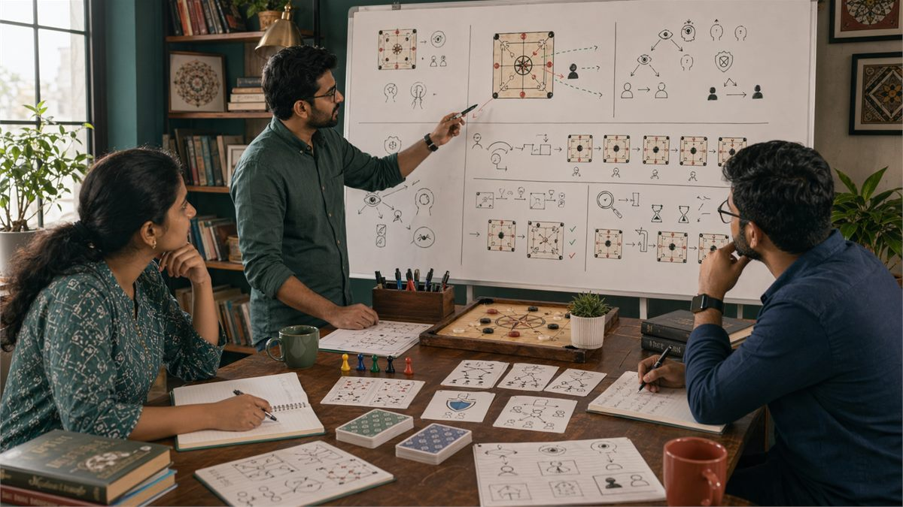

# Game Awareness Development

## 🪶 Introduction

Game awareness refers to the comprehensive understanding of everything happening in a game at any given moment. It encompasses knowing your own position, understanding what opponents are likely holding or planning, recognizing patterns in how the game is developing, and anticipating how situations will evolve. This awareness serves as the foundation for all strategic decisions, and without it, even the most sophisticated analytical techniques produce poor results.

Developing game awareness is not a single skill but a combination of observation, memory, pattern recognition, and mental modeling that together give you a complete picture of the game state. In Indian games where information is often incomplete or asymmetric, this comprehensive awareness is particularly valuable for making accurate assessments and optimal decisions.

This guide will help you understand what game awareness involves, why it matters more than individual techniques, and how to systematically develop this capability through deliberate practice. The goal is to build such thorough awareness that good decisions become obvious rather than requiring conscious analysis.

---

## 🖼️ Game Awareness Overview

---

## 🎯 What Is Game Awareness?

Game awareness is the mental model you maintain of the entire game state, including your position, opponents' likely positions, the distribution of remaining resources, and how the game is likely to develop from here. It is not a single observation but an integrated understanding of all relevant factors that influence decisions.

High game awareness means knowing not just what has happened but what is likely to happen next, what options are available given the current state, and how different choices will affect future possibilities. It means reading opponents accurately enough to anticipate their actions and planning several moves ahead while remaining flexible enough to adapt when unexpected things happen.

Game awareness differs from game knowledge. Knowledge is what you know about game rules and general strategies. Awareness is what you know about the specific current game you are playing. Both matter, but awareness is more immediately relevant to each decision you make.

The quality of your game awareness directly predicts your decision quality. When awareness is high, good decisions become easier to identify. When awareness is low, even technically correct decisions can fail because they do not fit the actual situation.

# 🧠 1. Components of Complete Game Awareness

Complete game awareness consists of several integrated components that together give you a full picture of any game situation. Understanding these components helps you identify which aspects of awareness you need to develop most.

Self-awareness involves understanding your own position completely, including the strengths and weaknesses of your current state, what options are available to you, and how your position compares to likely opponent positions. This sounds obvious but many players make decisions without fully understanding their own situation.

Opponent modeling involves estimating what opponents hold, what they are likely to do, and how they perceive your position. This requires gathering information through observation and making reasoned inferences from that information.

Resource tracking involves knowing what remains in the game, whether in shared pools, opponent hands, or undealt cards. This information constrains what is possible and influences probability estimates for different outcomes.

Situational awareness involves understanding the current phase of the game, what stakes are at risk, and what the likely timeline is for key decisions. Different situations call for different approaches, and recognizing the current situation type helps calibrate decision intensity.

# 🧠 2. Observation Techniques for Better Awareness

Observation is the foundation of game awareness. Without accurate observations, your mental model of the game will be flawed, leading to systematic errors in decision-making. Developing sharp observation skills requires deliberate practice and specific techniques.

Selective attention means focusing on the most relevant information while not ignoring important details. Games contain too much information to process everything equally, so directing attention to the most decision-relevant elements improves awareness efficiency.

Pattern recognition in observation means noticing not just individual events but sequences and trends. An opponent making an unusual play once might be a tell. An opponent making the same unusual play repeatedly reveals a pattern that can inform your strategy.

Environmental awareness includes factors beyond the immediate game state, such as opponent body language, pace of play changes, and emotional states. These factors often provide information that is not part of the formal game but still influences outcomes.

Training observation means practicing in conditions that require attention to detail, such as reviewing game records to identify information you missed during actual play. This training builds habits that carry over into live game situations.

# 🧠 3. Memory Integration in Game Awareness

Game awareness requires integrating information from throughout the game into a coherent mental model that you can access during decisions. Memory failures directly degrade awareness quality, leading to decisions based on incomplete information.

Working memory management during games means maintaining relevant information in accessible form while avoiding cognitive overload. This often requires external aids like notation or mental tricks that extend working memory capacity.

Long-term pattern memory helps by providing templates for recognizing game types and situations. When you have seen similar situations before, your brain can quickly access relevant strategic principles rather than analyzing from scratch each time.

Memory integration means connecting new observations to existing knowledge to build a complete picture. When you observe something, ask yourself how it fits with what you already know and what it implies about things you have not directly observed.

Memory review immediately after games consolidates important information into long-term storage while details are fresh. This review also reveals what you missed, which helps you focus observation training on gaps in your awareness.

# 🧠 4. Reading Opponents and Their Intentions

Understanding what opponents intend is a crucial component of game awareness that many players neglect. Opponent intentions are not directly observable but must be inferred from behavior, and developing this ability significantly improves decision quality.

Behavioral reading involves looking for patterns in how opponents play that reveal information about their position or strategy. These patterns might involve which actions they take, when they take them, and how their behavior changes across situations.

Intention inference requires combining observations with reasonable assumptions about how rational players approach different situations. If an opponent takes an unusual action, they likely have a reason. Understanding possible reasons helps predict future actions.

Multi-level thinking involves considering not just what opponents will do but what they think you will do, and how that influences their choices. This is particularly important in games where opponents are also analyzing you.

Reading accuracy improves with experience and deliberate attention. Keeping track of your reading accuracy over time reveals whether you are getting better at reading opponents and where specific weaknesses lie.

# 🧠 5. Situational Context and Phase Awareness

Games typically progress through recognizable phases, and your awareness should include understanding which phase you are in and how that affects appropriate strategy. What is optimal in one phase may be suboptimal in another.

Early game awareness focuses on information gathering and position building. Decisions should be oriented toward establishing solid foundations rather than trying to end games prematurely.

Mid-game awareness shifts to strategic positioning and momentum. Understanding relative standing and trajectory becomes more important, and decisions should account for how current choices affect future options.

Late game awareness focuses on converting advantages and minimizing losses when behind. The range of possible outcomes narrows, and decisions become more binary about whether to continue fighting or accept a limited loss.

Transitional awareness involves recognizing when phases change and adjusting strategy accordingly. Missing transitions leads to using outdated strategies that do not fit current situations.

# 🧠 6. Threat and Opportunity Assessment

Game awareness must include assessment of both threats to your position and opportunities for improvement. Neither should be neglected, and both require attention to be fully integrated into your strategic decisions.

Threat assessment involves recognizing dangerous situations before they become critical, understanding how threats develop over time, and identifying which threats are most urgent and which are most dangerous. This allows prioritization of defensive responses.

Opportunity assessment involves recognizing advantageous situations that could be exploited, understanding what would be required to capitalize on them, and evaluating whether the opportunity is worth pursuing relative to other options.

The relationship between threats and opportunities requires balancing. Sometimes pursuing an opportunity creates new threats. Sometimes addressing a threat requires sacrificing an opportunity. Understanding these trade-offs is essential for integrated strategic thinking.

Regular reassessment of threats and opportunities keeps your awareness current as the game evolves. Static assessments from early game become outdated as situations change.

# 🧠 7. Building Comprehensive Mental Models

A mental model is your internal representation of the game state that you use for decision-making. Building comprehensive mental models means creating representations that capture all decision-relevant information in a usable form.

Model accuracy means your internal representation matches the actual game state closely enough for decisions to be well-informed. Inaccurate models produce systematic errors regardless of how good your decision process is.

Model completeness means your model captures all the information relevant to decisions, not just the obviously important elements. Missing relevant information often leads to preventable mistakes.

Model usability means the information in your model is accessible during decision-making. Information you know but cannot access during critical moments does not help. Building accessible models requires practice and appropriate structure.

Model updating means maintaining accuracy as the game evolves. Outdated models that do not reflect current state produce progressively worse decisions as games progress.

# 🧠 8. Awareness Calibration and Improvement

Your awareness is only valuable if it is accurate, and developing calibration practices helps you maintain and improve awareness quality over time. Awareness that feels complete but is actually missing important information is dangerous because it produces false confidence.

Testing awareness accuracy involves making predictions based on your model and checking whether those predictions come true. Consistently accurate predictions indicate good awareness. Systematic prediction errors reveal where awareness is weak.

Updating awareness based on new information requires willingness to revise your model when evidence contradicts it. Holding onto outdated beliefs despite contradictory evidence degrades awareness quality.

Training awareness through deliberate practice in low-stakes situations builds skills that transfer to higher-stakes contexts. The goal is to make strong awareness habits automatic so they operate effectively even under pressure.

---

## ⚠️ Common Mistakes

1. **Focusing only on your own position and ignoring opponent states**: Complete awareness requires understanding the entire game, not just your own situation.

2. **Forming beliefs early and failing to update as new information arrives**: Initial assessments are often wrong. Willingness to update is essential for maintaining accurate awareness.

3. **Remembering recent events more clearly than earlier events (recency bias)**: Important information from earlier in games often gets forgotten. Systematic review helps counter this.

4. **Reading too much into unusual events that might be random noise**: Not every deviation from pattern is meaningful. Separating signal from noise requires appropriate skepticism.

5. **Failing to track resources and what remains in the game**: Awareness of current positions without understanding remaining possibilities is incomplete.

6. **Not practicing awareness skills deliberately**: Assuming awareness will improve automatically without specific practice leads to slow or no improvement.

---

## 🧾 Summary

Game awareness is the comprehensive understanding of game states that enables good strategic decisions. It integrates observation, memory, pattern recognition, and mental modeling into a complete picture of the current situation and likely future developments. Developing awareness requires deliberate practice, regular calibration checking, and willingness to update beliefs when evidence contradicts them.

---

## 🔥 SEO Keywords

game awareness skills
board reading techniques
comprehensive game awareness
opponent reading India
game observation skills
situational awareness gaming
mental model games
awareness calibration
game state assessment
strategic awareness development

---

## Related Pages

- [Fundamentals of Game Insights](./fundamentals.md)
- [Decision Making Fundamentals](./decision-making.md)
- [Pattern Recognition Skills](./pattern-recognition.md)
- [Play Styles Analysis](./play-styles.md)
- [Risk Balance in Games](./risk-balance.md)

## External Reference

For a broader reference, see [related gameplay notes](https://market-lab-cmd.github.io/india-skill-gaming-hub/)