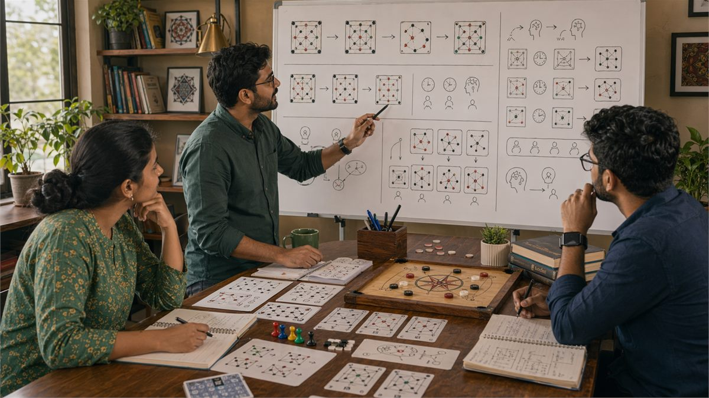

# Pattern Recognition Skills for Indian Games

## 🪶 Introduction

Pattern recognition is the ability to identify recurring elements in game situations that behave in predictable ways. This skill is fundamental to strategic performance because it allows you to apply learned knowledge to new situations rather than analyzing every moment from first principles. When you recognize a pattern, you immediately know how to respond without requiring extensive deliberation.

In Indian games, pattern recognition operates at multiple levels. You recognize specific card combinations and know their strength. You recognize opponent behavior patterns and know what they imply. You recognize game situations and know what strategies typically work in them. Each level of pattern recognition contributes to overall decision quality and speed.

This guide explores how patterns work, how to develop pattern recognition abilities, and how to avoid common errors that arise from misidentified or overgeneralized patterns. The goal is to build a rich library of patterns that serve you well across diverse game situations.

---

## 🖼️ Pattern Recognition Overview

---

## 🎯 What Is Pattern Recognition?

Pattern recognition in games is the process of matching current situations to previously encountered situations and applying appropriate responses based on that match. When you see something familiar, pattern recognition allows you to act on that familiarity rather than analyzing from scratch.

Effective pattern recognition requires both a pattern library built from experience and a matching process that correctly identifies when current situations match library patterns. Both components are essential. A large library does not help if you cannot recognize when situations match. Equally, recognizing situations does not help if you have no useful patterns to apply.

Pattern recognition operates largely in the background of thought, producing intuitions and impressions that influence decisions without requiring conscious deliberation. This automatic processing is valuable for speed but can lead to errors when patterns are misidentified or when situations that look similar actually differ in crucial respects.

Developing pattern recognition involves building experience across many game situations, reflecting on what happened to create pattern knowledge, and practicing recognition so that pattern matching becomes fast and accurate.

# 🧠 1. Types of Patterns in Indian Games

Patterns appear at multiple levels in games, and recognizing the type of pattern you are dealing with helps determine how reliable it is and how to respond to it.

Mechanical patterns involve game elements and their interactions. In card games, certain combinations of cards tend to work together. In board games, certain piece configurations create strategic opportunities. These patterns are reliable because they reflect game mechanics that do not change based on opponent behavior.

Behavioral patterns involve how opponents act across situations. Some players play aggressively when they have strong positions. Others play conservatively regardless of their hand. These patterns help predict opponent actions but are less reliable than mechanical patterns because opponents can choose to act differently.

Situational patterns involve common game states that recur across many games. Recognizing these patterns allows you to apply appropriate strategies without analyzing each situation from scratch.

Temporal patterns involve sequences of events that tend to unfold in characteristic ways. Some situations tend to develop in predictable directions, which allows for anticipation and planning.

Each pattern type has different reliability and requires different treatment. Mechanical patterns are highly reliable. Behavioral patterns depend on opponent consistency. Situational patterns work when situations truly match. Temporal patterns require accurate prediction of development.

# 🧠 2. Building Pattern Libraries Through Experience

Pattern recognition requires patterns to recognize, and these patterns come primarily from accumulated game experience. The more situations you encounter, the richer your pattern library becomes and the more situations you can match to existing patterns.

Deliberate experience variation helps build diverse pattern libraries. Playing against different opponents, trying different strategies, and exposing yourself to varied game states creates more patterns than repeatedly playing the same way against the same opponents.

Post-game reflection converts individual experiences into pattern knowledge. Asking yourself what happened, why it happened, and whether it fits any general patterns transforms raw experience into usable knowledge.

Studying documented games and strategic analysis expands your pattern library beyond what personal experience provides. Books, articles, and community discussions reveal patterns that you might not encounter independently.

Pattern libraries should be organized by situation type for easy access during games. Having patterns organized around common decisions helps you retrieve relevant knowledge when facing those decisions.

# 🧠 3. Pattern Matching and Application

Having patterns in your library does not help unless you can correctly match current situations to relevant patterns and apply the appropriate responses. Pattern matching is a skill that improves with practice and deliberate attention.

Current situation assessment requires identifying the key features of the current moment that determine which pattern applies. In complex situations, many features are present, and correctly identifying which features matter most for pattern matching is essential.

Similarity assessment involves judging how closely the current situation matches known patterns. Exact matches are rare. Most situations are partial matches that require adaptation of pattern-based responses.

Response selection involves choosing which pattern response to apply when multiple patterns might match. Sometimes patterns agree on the best action. Sometimes they conflict, requiring judgment about which pattern is more relevant.

Adaptation is often required because current situations rarely match patterns exactly. Understanding the principles behind patterns allows you to adapt responses to fit situations that are similar but not identical to library patterns.

# 🧠 4. Avoiding False Pattern Recognition

Not every apparent pattern is real. Random variation creates apparent patterns that do not reflect underlying regularities. Recognizing when patterns are real versus illusory prevents costly errors based on false pattern knowledge.

Statistical significance requires enough observations before concluding a pattern exists. One observation cannot establish a pattern. A few observations might show a tendency but could also reflect random variation. Sufficient observations distinguish real patterns from noise.

Alternative explanations should be considered before accepting a pattern as real. Apparent patterns might reflect coincidence, observer bias, or confounding factors rather than genuine regularities.

Testing patterns against new data helps verify they are real. If a pattern you identified works consistently in new situations, it is probably genuine. If it fails in new situations, it was probably illusory.

Conservative pattern application means treating patterns as provisional until they are well-established. This prevents overgeneralization from limited data while still allowing patterns to inform decisions.

# 🧠 5. Pattern Recognition Speed Development

Pattern recognition speed matters because games involve time pressure, and slow recognition means slow decisions that can be exploited by faster opponents. Developing recognition speed requires practice specifically aimed at faster matching.

Recognition drills involve exposing yourself to game situations and practicing rapid pattern matching. With practice, the matching process becomes faster as neural pathways strengthen.

Chunking combines multiple elements into single recognizable units. Rather than recognizing each card in a hand individually, experienced players recognize the hand type or strength level as a single chunk. This reduces the number of elements that must be matched and speeds recognition.

Preview information helps by providing partial information before full exposure. In games where you see cards sequentially, recognizing partial patterns allows faster identification than waiting for complete information.

Pattern template activation means learning to quickly identify which type of pattern is relevant before matching specific instances. This hierarchical approach speeds recognition by narrowing the search space.

# 🧠 6. Pattern Recognition in Opponent Behavior

Recognizing patterns in how opponents play allows prediction of their future actions. This predictive capability improves decision quality by allowing you to prepare for likely opponent moves.

Behavioral pattern identification requires observing opponent actions across multiple situations and noting consistent tendencies. These tendencies might be absolute or conditional. Absolute tendencies hold regardless of situation. Conditional tendencies appear in specific situations.

Confidence in behavioral patterns depends on the amount of data supporting them. Patterns observed many times are more reliable than patterns observed only a few times. New opponents require more observation before patterns become reliable.

Behavioral pattern updating recognizes that opponents may change their patterns over time. Stale observations of past behavior might not reflect current tendencies. Maintaining awareness of pattern changes is important for keeping predictions accurate.

Exploiting behavioral patterns involves adjusting your strategy to take advantage of predictable opponent tendencies. If you know an opponent always plays aggressively in a certain situation, you can prepare to exploit that tendency.

# 🧠 7. Pattern Recognition Under Uncertainty

Game situations rarely provide complete information, and pattern recognition must work even with partial information. Developing skills for pattern recognition under uncertainty prevents analysis paralysis when information is incomplete.

Partial pattern matching involves recognizing patterns even when some elements are unknown. If you recognize the pattern type from available information, you can make educated guesses about missing elements.

Probability estimation in patterns involves recognizing that pattern matches are rarely certain. Assigning probabilities to pattern matches allows appropriate confidence in pattern-based conclusions.

Pattern combination involves using multiple patterns together to form more complete pictures. If one pattern suggests one conclusion and another pattern suggests another, combining them can reveal a more accurate assessment.

Uncertainty acknowledgment means recognizing when pattern recognition is unreliable due to insufficient information. In these cases, treating pattern-based conclusions as uncertain prevents overconfident decisions based on shaky pattern matches.

# 🧠 8. Pattern Recognition Quality Assessment

Pattern recognition abilities improve only when you assess how well you are doing and identify where weaknesses remain. Regular assessment reveals patterns that are well-developed versus areas that need work.

Accuracy tracking involves recording pattern matches and checking whether they turned out to be correct. High accuracy indicates well-developed pattern recognition in that area. Low accuracy indicates recognition errors or false patterns.

Speed measurement involves timing how long it takes to recognize patterns in different situations. Slow recognition in situations where speed matters indicates areas needing practice.

Coverage assessment involves checking which types of situations you have patterns for versus which you lack patterns for. Gaps in pattern coverage indicate areas where more experience or study is needed.

Comparative analysis involves comparing your pattern recognition to others, either through direct competition or through observation. This reveals where your recognition is strong versus where it lags.

---

## ⚠️ Common Mistakes

1. **Seeing patterns in random noise**: Not every fluctuation represents a real pattern. Demanding sufficient data before accepting patterns prevents false conclusions.

2. **Overgeneralizing from limited observations**: A pattern observed a few times might be coincidence. Treating limited observations as strong evidence leads to unreliable patterns.

3. **Failing to update patterns when opponents change behavior**: Patterns from past observations might not reflect current opponent tendencies. Keeping patterns current requires ongoing observation.

4. **Confusing different pattern types**: Applying behavioral patterns to mechanical situations or vice versa produces errors. Understanding which pattern type applies is essential.

5. **Treating pattern matches as certain rather than probabilistic**: Pattern recognition is never perfect. Overconfidence in pattern matches leads to inadequate consideration of alternative possibilities.

6. **Ignoring contradictions between multiple patterns**: Sometimes different patterns suggest different conclusions. Weighing pattern conflicts is necessary for accurate conclusions.

---

## 🧾 Summary

Pattern recognition allows rapid, intuitive response to game situations by matching current conditions to previously learned patterns. Building rich pattern libraries through diverse experience, practicing rapid matching, and avoiding false patterns produces faster and more accurate recognition. Regular assessment of recognition quality identifies improvement areas and maintains accuracy over time.

---

## 🔥 SEO Keywords

pattern recognition games
game pattern identification
behavioral patterns gaming
pattern library development
pattern matching skills
gaming intuition development
opponent pattern analysis
pattern recognition speed
uncertainty in patterns
pattern quality assessment

---

## Related Pages

- [Fundamentals of Game Insights](./fundamentals.md)
- [Common Mistakes in Game Analysis](./common-mistakes.md)
- [Game Awareness Development](./game-awareness.md)
- [Decision Making Fundamentals](./decision-making.md)
- [Strategic Thinking Development](./strategic-thinking.md)

## External Reference

For a broader reference, see [related gameplay notes](https://market-lab-cmd.github.io/india-skill-gaming-hub/)