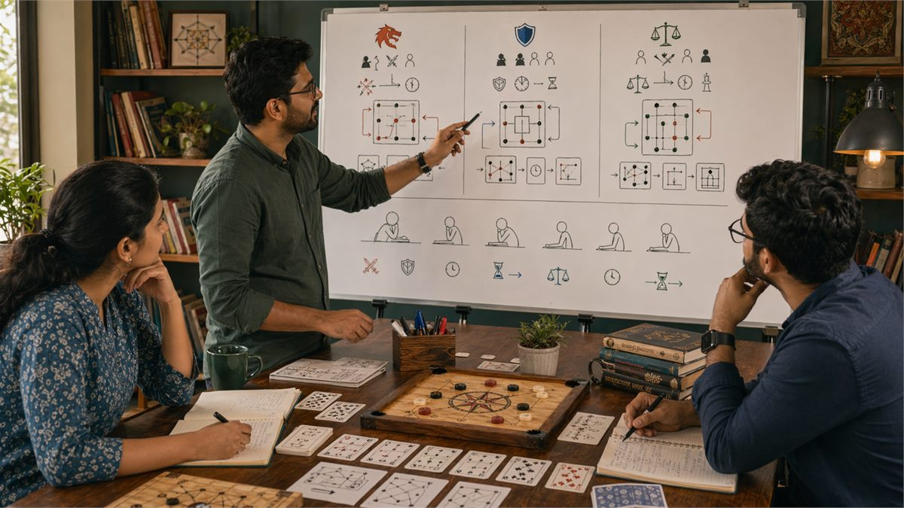

# Play Styles Analysis for Indian Games

## 🪶 Introduction

Understanding play styles helps you anticipate opponent behavior, exploit predictable tendencies, and adapt your own strategy to different situations. In the diverse landscape of Indian games, players bring varied approaches to competition, and recognizing these approaches allows you to make better decisions against each type of opponent.

This guide explores the different play styles you will encounter, how to identify them, and how to adjust your strategy based on what you observe. The goal is to develop flexible strategic thinking that serves you well regardless of what type of opponent you face.

Play style analysis is distinct from general game strategy because it focuses on individual differences between players rather than game mechanics or optimal play. Understanding that players differ, and knowing how they differ, transforms you from someone playing against an anonymous opponent to someone playing against a specific person with known tendencies.

---

## 🖼️ Play Styles Overview

---

## 🎯 What Are Play Styles?

Play styles are characteristic patterns of behavior that players exhibit across multiple game situations. These patterns reflect individual preferences, skill levels, emotional tendencies, and strategic approaches that persist across games and situations. Recognizing play styles helps you predict what opponents will do and adjust your strategy accordingly.

Play styles are not fixed categories but tendencies that manifest with varying consistency. A player might usually play conservatively but shift to aggressive when conditions change. The key is recognizing the baseline tendency while remaining alert to shifts that signal changed conditions.

Style identification requires observation across multiple situations because individual actions might be misleading. A single aggressive play might be an anomaly or might indicate a style shift. Pattern observation across many decisions reveals true tendencies.

Style-informed strategy involves adjusting your approach based on what you know about opponent tendencies. Against conservative players, you might apply more pressure. Against aggressive players, you might play more defensively. The same game state calls for different actions depending on who you are playing.

# 🧠 1. Conservative Play Style Characteristics

Conservative players prioritize safety over upside, preferring options that protect their position even when riskier alternatives might produce better expected value. Understanding this style helps you recognize when you are facing a conservative opponent and adjust your pressure accordingly.

Conservative players typically underplay strong hands, hesitate to commit resources aggressively, and prefer to react to opponent actions rather than initiate them. They will often fold or check rather than bet or raise, and they tend to fold when facing significant pressure.

This style emerges from risk aversion, experience that taught them to fear losses more than they value wins, or strategic belief that preservation leads to long-term success. The weakness of conservative play is that it sacrifices value in situations where aggression would be profitable.

Against conservative players, applying pressure often works because they will yield position rather than fight back. However, you must be careful not to overextend against them if they show unexpected aggression, as they may be representing strength they do not actually hold.

# 🧠 2. Aggressive Play Style Characteristics

Aggressive players prioritize upside over safety, preferring options that create big results even when those options carry significant risk. Recognizing this style helps you prepare for their attacks and exploit their risk-taking when they overcommit.

Aggressive players typically overplay moderate hands, initiate action rather than react to it, and apply pressure when they see weakness. They will bet and raise rather than check and fold, and they tend to call rather than fold when facing pressure.

This style emerges from confidence, risk tolerance, experience that taught them that aggression wins games, or strategic belief that pressure creates opportunities. The weakness of aggressive play is that it can be exploited by players who recognize it and play defensively when appropriate.

Against aggressive players, patience often works because they will eventually overextend and create opportunities. However, being too passive against aggressive players can allow them to dominate the game and steal value from you through sheer willingness to fight.

# 🧠 3. Balanced Play Style Characteristics

Balanced players mix conservative and aggressive approaches appropriately based on game conditions. They adjust their style to fit situations rather than playing the same way regardless of circumstances. This flexibility makes them harder to read and more challenging to play against.

Balanced players typically evaluate each situation on its merits, mixing strategic approaches based on what the moment requires. They will play aggressively when aggression is warranted and conservatively when conservation is appropriate. Their play responds to game state rather than reflecting fixed preferences.

This style emerges from sophisticated strategic understanding, ability to read situations accurately, and emotional control that allows appropriate responses rather than knee-jerk reactions. The weakness of balanced play is that it requires accurate reading, and when reading fails, the balanced approach can produce confused play.

Against balanced players, careful observation is essential because they are less predictable than style-consistent players. Exploiting their play requires accurate reading and willingness to adjust your approach as they adjust theirs.

# 🧠 4. Tight Play Style Characteristics

Tight players play fewer hands or make fewer moves than average, focusing their game around situations where they have strong confidence in their position. This selectivity reduces variance but also reduces opportunities.

Tight players typically fold or check frequently, bet strongly when they do play, and avoid marginal situations. They are selective about which games and which situations they engage with, and they generally play fewer decisions than opponents.

This style emerges from patience, high standards for starting positions, or experience that taught them to avoid marginal situations. The weakness of tight play is that it can be exploited through stealing blinds or positions when they fold, and their strong hands become obvious when they do finally play.

Against tight players, stealing position and applying pressure when they fold works until they actually have strong holdings. Recognizing when a tight player suddenly plays aggressively signals they likely have a premium hand worth paying attention to.

# 🧠 5. Loose Play Style Characteristics

Loose players play more hands or make more moves than average, engaging frequently and broadly. This engagement creates more opportunities but also more variance and potential for mistakes.

Loose players typically call or check frequently, play many hands or take many actions, and are willing to see flops or continue into uncertain situations. They engage broadly rather than selectively and often play speculative holdings hoping to improve.

This style emerges from entertainment value of action, confidence in ability to navigate difficult situations, or strategic belief that loose play creates more opportunities. The weakness of loose play is that it creates situations where opponents can extract value by playing tightly against them.

Against loose players, playing tightly and extracting value when they engage works well. However, calling down too broadly against very loose players can be costly because they may have legitimately strong hands when they suddenly play seriously.

# 🧠 6. Identifying Opponent Style in Practice

Style identification requires observation across multiple decisions and games because individual actions can be misleading. Building confidence in your style reads takes time but improves decision quality significantly once established.

Observation checklist involves tracking multiple dimensions of opponent play including starting hand selection, aggression frequency, reaction to pressure, and consistency across situations. Patterns across these dimensions reveal style.

Confidence calibration for style reads should be proportionate to observation amount. Initial reads based on limited observation should be treated as tentative and updated as more data accumulates.

Style stability assessment asks whether opponent style is consistent or varying. Some players have stable styles that persist across games. Others adjust their approach based on conditions. Understanding which type you are facing affects how to use style information.

Updating style reads when behavior changes prevents being trapped by outdated assessments. If a conservative player suddenly plays aggressively, the style read needs updating rather than assuming the aggression is a temporary deviation.

# 🧠 7. Adjusting Strategy Based on Style

Style information should influence your strategic decisions, with different approaches appropriate against different opponent types. This adjustment exploits style-consistent opponents and adapts to style-changing opponents.

Against conservative players, applying pressure through aggression often works better than slow-playing. They will yield position more often than they fight back, creating opportunities for profitable steals.

Against aggressive players, patience and traps work better than fighting fire with fire. Letting them overextend and then punishing their aggression extracts value from their risk-taking.

Against balanced players, careful observation and adjustment matching their approach prevents you from being exploited by their flexibility.

These adjustments require accurate style reads. Incorrect reads lead to wrong adjustments that can be more harmful than not adjusting at all. When style reads are uncertain, defaulting to balanced play is safer than over-adjusting to a potentially wrong read.

# 🧠 8. Managing Your Own Play Style

Understanding your own play style helps you maintain awareness of how opponents see you and how to adjust when your default style is being exploited. Self-knowledge allows strategic flexibility rather than mechanical consistency.

Style self-assessment involves honestly evaluating your own tendencies, strengths, and weaknesses. This assessment should be based on observation of your own decisions across many games rather than self-perception, which may be inaccurate.

Exploitable tendency recognition means identifying patterns in your play that observant opponents might exploit. If you always fold to pressure, opponents will pressure you constantly. If you always raise with strong hands, opponents will give you credit for those hands even when you are bluffing.

Strategic style adjustment involves consciously shifting your play style to prevent exploitation when you notice opponents adjusting to your tendencies. This might mean playing more aggressively when you normally play conservatively, or vice versa, to keep opponents uncertain.

Style development involves expanding your repertoire beyond your natural tendencies, building skills that allow you to play effectively in styles that do not come naturally to you.

---

## ⚠️ Common Mistakes

1. **Assuming style is fixed and never changes**: Players adjust their styles based on conditions, opponents, and game state. Outdated style assessments can lead to wrong conclusions.

2. **Drawing strong conclusions from limited observation**: One or two observations cannot establish reliable style reads. Treating tentative reads as established beliefs leads to exploitation.

3. **Over-adjusting to potentially incorrect reads**: If your read on opponent style might be wrong, adjusting your strategy heavily to that read might make things worse than playing normally.

4. **Ignoring your own style's visibility to opponents**: Opponents can see your tendencies just as you can see theirs. Being predictable in your own style creates exploitation opportunities.

5. **Confusing player skill with play style**: Skill and style are different. A tight player might be tight because they are skilled or because they are risk-averse. Same behavior can come from different reasons.

6. **Failing to adjust when style-based strategy is not working**: If adjustments based on style reads are not producing expected results, the style read might be wrong. Flexibility prevents stubborn losses.

---

## 🧾 Summary

Play styles are characteristic patterns of behavior that persist across game situations. Recognizing conservative, aggressive, balanced, tight, and loose styles helps you predict opponent actions and adjust strategy accordingly. Build style reads from multiple observations, treat initial reads as tentative, and update assessments when behavior changes. Understanding your own style allows you to prevent exploitation and expand your strategic repertoire.

---

## 🔥 SEO Keywords

play style analysis
opponent style recognition
conservative player strategy
aggressive player exploitation
balanced play approach
tight player tactics
loose player handling
style-based strategy
player pattern analysis
strategic style adjustment

---

## Related Pages

- [Pattern Recognition Skills](./pattern-recognition.md)
- [Decision Making Fundamentals](./decision-making.md)
- [Game Awareness Development](./game-awareness.md)
- [Common Mistakes in Game Analysis](./common-mistakes.md)
- [Scenarios and Decision Points](./scenarios.md)

## External Reference

For a broader reference, see [related gameplay notes](https://market-lab-cmd.github.io/india-skill-gaming-hub/)